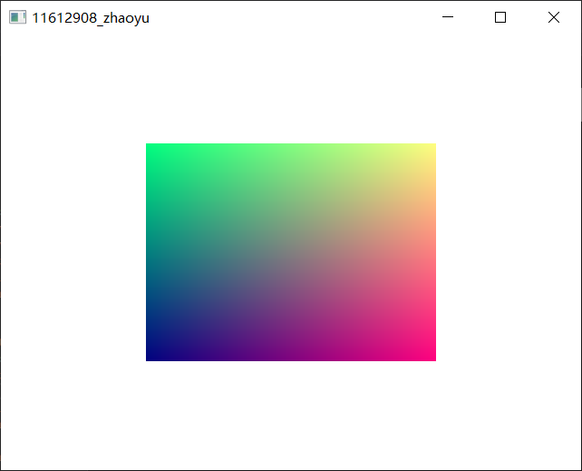

# Lab3

11612908 赵宇

## Experimental aims

- know how to use VAO and VBO

- write vertex shader and fragment shader

- know how to draw basic 2-D and 3-D shapes 

## Experimental setting
GLEW
windows 10
GPU
OpenGL 3.3

## Experimental content（key functions with code and clear comments）

1. create the window object

2. set the dimentions of window and start the depth test

3. create an array to store the vertex information

4. create and bind VAO and VBO

5. call `glBufferData` to transfer the data of the array to the buffers

6. call `glVertexAttribPointer` to set the pointers of vertex attributes

7. set the model matrix, observation matrix and projecting matrix

8. Call `glDrawArrays` to draw 12 triangles


#### code:

- header:

  ```c++
  #include <iostream>
  #include <glm/glm.hpp>
  #include <glad/glad.h>
  #include <GLFW/glfw3.h>
  #include <glm/gtc/type_ptr.hpp>
  #include <glm/gtc/matrix_transform.hpp>
  #ifdef Local
  #define debug(...) fprintf(stderr, __VA_ARGS__)
  #else
  #define debug(...) 
  #endif
  using namespace std;
  
  GLFWwindow* window;
  const int windowL = 640, windowD = 480;
  typedef GLuint vao;
  typedef GLuint vbo;
  typedef GLuint shader;
  typedef GLuint GLpro;
  const float vertex[] = { 0.5f, -0.5f, 0.0f, -0.5f, -0.5f, 0.0f, 0.5f,  0.5f, 0.0f, -0.5f,
  		0.5f, 0.0f, 0.0f, 0.75f, 0.0f, 0.75f,  0.0f, 0.0f, 0.5f, -0.5f, 0.0f, 0.75f, 0.75f,
  		0.0f, 0.5f,  0.5f, 0.0f, 0.0f, 0.75f, 0.0f }; // position
  float ver_col[60]; // position and color
  
  void gen_color()
  {
  	for (int i = 0; i < 30; ++i)
  	{
  		if (i % 3 == 0)
  		{
  			for (int j = 0; j < 3; ++j)
  			{
  				ver_col[i * 2 + j] = vertex[i + j];
  				float color = vertex[i + j] + 0.5;
  				if (color > 1.0f)
  				{
  					color = -1.0f + (color - 1.0f);
  				}
  				else if (color < -1.0f)
  				{
  					color = 1.0 - (-1.0f - color);
  				}
  				ver_col[i * 2 + j + 3] = color;
  			}
  		}
  	}
  }//get color
  ```

  Color is generated by the position.

  Position and Color are stored in `float ver_col`;

- shaders(3.3)

   It uses the position we defined in header and the color we calculated in header.

  ```c++
  const char *vertexShaderSource = "#version 330 core\n"
  "layout (location = 0) in vec3 aPos;\n"
  "layout (location = 1) in vec3 aColor;"
  "out vec3 outcolor;"
  "void main()\n"
  "{\n"
  "   gl_Position = vec4(aPos.x, aPos.y, aPos.z, 1.0);\n"
  "	outcolor = aColor;"
  "}\0";
  const char *fragmentShaderSource = "#version 330 core\n"
  "out vec4 FragColor;\n"
  "in vec3 outcolor;"
  "void main()\n"
  "{\n"
  "   FragColor = vec4(outcolor, 1.0f);\n"
  "}\n\0";
  ```

- core code(both cube and rectangle)

   ```c++
  int main()
  {
  	gen_color();
  	debug("color\n");
  	for (int i = 0; i < 60; ++i)
  	{
  		debug("%f ", ver_col[i]);
  		if ((i + 1) % 6 == 0)
  		{
  			debug("\n");
  		}
  	}
  	/*pre check glfw and glad init.*/
  	if (!glfwInit())
  	{
  		debug("GLFW init failed.");
  		return -1;
  	}
  	window = glfwCreateWindow(windowL, windowD, "11612908_zhaoyu", NULL, NULL);
  	if (window == NULL)
  	{
  		glfwTerminate();
  		debug("window init failed.");
  		return -1;
  	}
  	glfwMakeContextCurrent(window);
  	if (!gladLoadGLLoader((GLADloadproc)glfwGetProcAddress))
  	{
  		debug("Load glad failed");
  		return -1;
  	}
  	vao VAO;
  	vbo VBO;
  	glGenVertexArrays(1, &VAO);
  	glGenBuffers(1, &VBO);
  	debug("VAO = %u, VBO = %u\n", VAO, VBO);
  	glBindVertexArray(VAO);
  	glBindBuffer(GL_ARRAY_BUFFER, VBO);
  	debug("VAO = %u, VBO = %u\n", VAO, VBO);
  	glBufferData(GL_ARRAY_BUFFER, sizeof(ver_col), ver_col, GL_STATIC_DRAW);
  	glVertexAttribPointer(0, 3, GL_FLOAT, GL_FALSE, 6 * sizeof(float), (void*)0);
  	glVertexAttribPointer(1, 3, GL_FLOAT, GL_FALSE, 6 * sizeof(float), (void*)(3 * sizeof(float)));
  	glEnableVertexAttribArray(0);
  	glEnableVertexAttribArray(1);
  	shader vertexShader = glCreateShader(GL_VERTEX_SHADER);
  	glShaderSource(vertexShader, 1, &vertexShaderSource, NULL);
  	glCompileShader(vertexShader);
  
  	shader fragmentShader = glCreateShader(GL_FRAGMENT_SHADER);
  	glShaderSource(fragmentShader, 1, &fragmentShaderSource, NULL);
  	glCompileShader(fragmentShader);
  
  	GLpro shaderProgram = glCreateProgram();
  	glAttachShader(shaderProgram, fragmentShader);
  	glAttachShader(shaderProgram, vertexShader);
  	glLinkProgram(shaderProgram);
  
  	glDeleteShader(vertexShader);
  	glDeleteShader(fragmentShader);
  	/*core code*/
  	while (!glfwWindowShouldClose(window)) {
  		glClear(GL_COLOR_BUFFER_BIT);
  		glClearColor(1.0f, 1.0f, 1.0f, 1);
  		/*draw a triangle*/
  		glUseProgram(shaderProgram);
  		glBindVertexArray(VAO);
  		/*
  		for (int i = 0; i < 8; ++i)
  		{
  			if(i != 3 && i != 4) glDrawArrays(GL_TRIANGLES, i, 3);
  		}
  		*/
  		/*
  		glDrawArrays(GL_TRIANGLES, 0, 3);
  		glDrawArrays(GL_TRIANGLES, 1, 3);
  		glBindVertexArray(0);
  		*/
  		/* Swap front and back buffers */
  		glfwSwapBuffers(window);
  		/* Poll for and process events */
  		glfwPollEvents();
  	}
  	/*close window*/
  	glfwTerminate();
  	return 0;
  }
  ```

  - when draw rectangle, use 

    ```c++
    	glDrawArrays(GL_TRIANGLES, 0, 3);
    	glDrawArrays(GL_TRIANGLES, 1, 3);
    ```

  - when draw cube, use

    ```c++
    	for (int i = 0; i < 8; ++i)
    	{
            if(i != 3 && i != 4) glDrawArrays(GL_TRIANGLES, i, 3);
    	}
    ```

    

## Experimental results

- rectangle:



- cube:


## Problems during experiment（optional）

- The color is to hard to become beautiful.